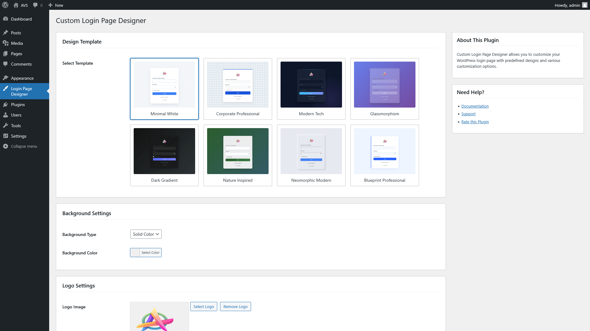
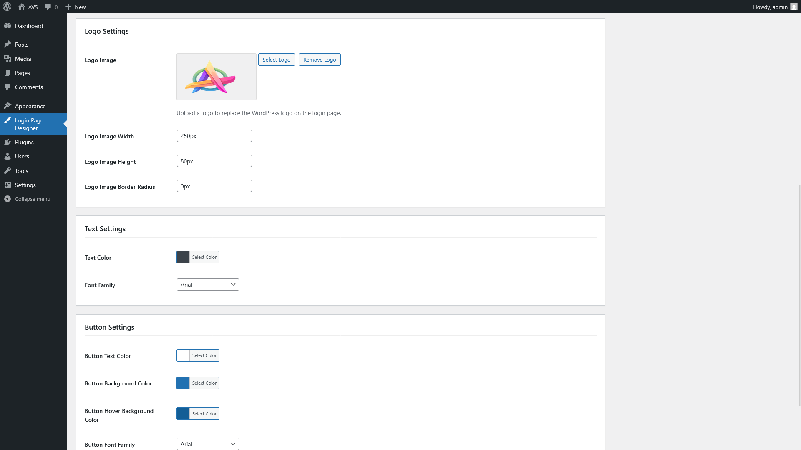
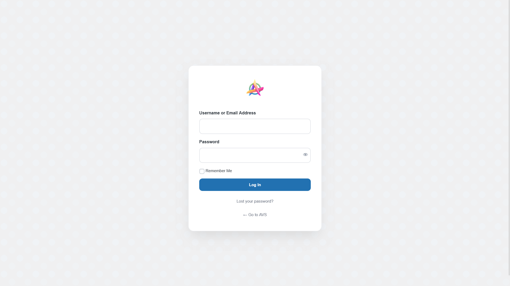
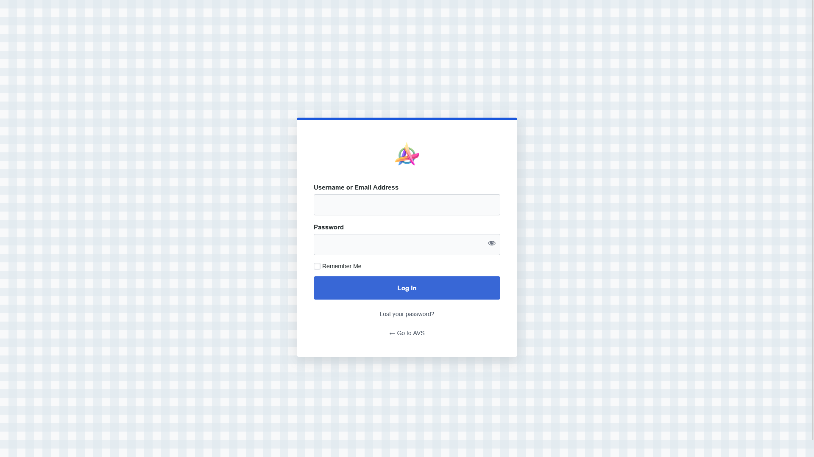

# 🎨 Custom Login Page Designer

**Transform your WordPress login page into a branded experience with elegant designs, custom backgrounds, logo uploads, and more.**

**Custom Login Page Designer** allows administrators to easily transform the default WordPress login page into a professional, branded experience with just a few clicks. Choose from elegant predefined designs and further customize colors, backgrounds, typography, and other elements to perfectly match your brand identity.

Say goodbye to the generic WordPress login page and welcome your users with a stunning, customized login experience that reflects your unique brand.

---

## ✨ Key Features

✅ **Predefined Professional Designs** – Multiple elegantly designed templates to instantly transform your login page  
🎨 **Background Customization** – Choose between solid colors, gradients, patterns, or custom images  
🖼️ **Logo Control** – Replace the default WordPress logo with your brand's logo, adjust size and positioning  
🔤 **Typography Customization** – Select from popular font families and customize text colors and sizes  
📝 **Form Styling** – Modify input fields appearance including borders, shadows, and focus states  
🔘 **Button Customization** – Style buttons with custom colors, borders, hover effects, and animations  
📱 **Mobile Responsive** – All designs look great on any device size  
🛠️ **User-Friendly Interface** – Intuitive admin settings with live preview  
⚡ **Performance Optimized** – Lightweight code that won't slow down your site  
📌 **Standards Compliant** – Built following WordPress coding standards and best practices  

---

## 📥 Installation

### Automatic Installation (Recommended)

1. Log in to your WordPress dashboard and navigate to **Plugins → Add New**
2. In the search field, type "Custom Login Page Designer"
3. Once you've found the plugin, click **Install Now**
4. After installation, click **Activate Plugin**
5. Go to **Login Page Designer** in the WordPress admin menu to customize your login page

### Manual Installation

1. Download the plugin zip file from the WordPress plugin repository
2. Log in to your WordPress dashboard and navigate to **Plugins → Add New**
3. Click the **Upload Plugin** button at the top of the page
4. Click **Choose File**, select the downloaded zip file, and click **Install Now**
5. After installation, click **Activate Plugin**
6. Alternatively, you can unzip the plugin file and upload the `custom-login-page-designer` folder via FTP to your `/wp-content/plugins/` directory
7. Go to **Login Page Designer** in the WordPress admin menu to customize your login page

---

## ❓ Frequently Asked Questions

### 🔹 Will this affect my admin dashboard appearance?  
No, this plugin only modifies the login page appearance. Your admin dashboard remains completely unchanged.

### 🔹 Can I upload my own background image?  
Yes! The plugin includes a media uploader that allows you to select from your media library or upload custom background images to create a truly unique login page.

### 🔹 Will my customizations remain after a WordPress update?  
Absolutely. All customizations are stored securely in the WordPress database and will persist through WordPress core updates.

### 🔹 Does this plugin slow down my website?  
No. The plugin is designed to be lightweight and only loads its assets on the login page, not on your main website or admin areas.

### 🔹 How do I reset to the default WordPress login page?  
You can either click the "Reset to Default" button in the plugin settings, or simply deactivate the plugin to restore the default WordPress login page.

### 🔹 Is this plugin compatible with other security plugins?  
Yes, Custom Login Page Designer is designed to be compatible with most WordPress security plugins. If you encounter any conflicts, please contact our support.

### 🔹 Does this plugin work with multisite?  
Yes, the plugin is fully compatible with WordPress Multisite installations.

---

## 🚀 Usage

After activating the plugin:

1. Navigate to **Login Page Designer** in your WordPress admin menu
2. Choose from one of the predefined professional designs
3. Customize the background (select from solid colors, gradients, patterns, or upload your own image)
4. Upload your custom logo and adjust its size and position
5. Adjust typography settings including font family, size, and colors
6. Style form elements and buttons to match your brand
7. Save your settings and visit your login page (`wp-login.php`) to view the changes
8. Use the live preview feature to see changes before saving

---

## 📸 Screenshots

<table>
  <tr>
    <td></td>
    <td></td>
  </tr>
  <tr>
    <td></td>
    <td></td>
  </tr>
</table>

---

## 🔄 Changelog

### 1.0.0
* Initial release with 8 professional templates
* Background customization features
* Logo upload and customization
* Typography controls
* Form and button styling options
* Mobile responsive designs
* User-friendly admin interface

---

## 🆘 Support

Need help? Have questions?
* For support requests, please visit our [support forum](https://wordpress.org/support/plugin/custom-login-page-designer/)
* For feature requests or bug reports, please [create an issue](https://github.com/vishwas-r/Custom-Login-Page-Designer/issues)

---

## 💖 Support This Project

If you find this plugin useful, consider [making a donation](https://www.paypal.com/paypalme/vishwasr92) to support continued development.

---

## 📃 License

This project is licensed under the GPLv3 License - see the [LICENSE](LICENSE) file for details.
